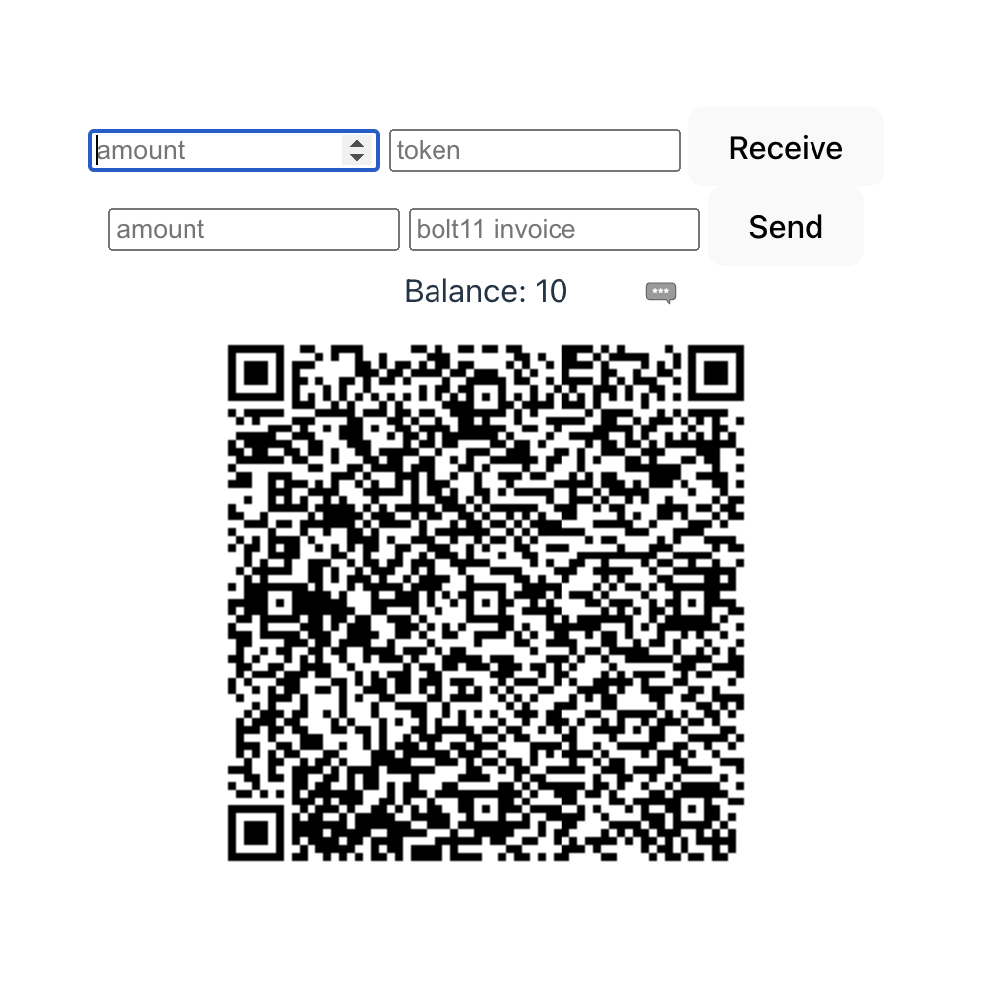

# Cashu Wallet

A bare bones [cashu](https://cashu.space) wallet implementation that can be used in any javascript application.

**NOTE**: This is super rough an early, and not feature complete. Please don't use in production!

## Background

Cashu wallets all (more or less) have the same basic features when it comes to state. We need to track the tokens which are minted, track invoices, and allow users to send and receive both ecash and lightning.

The UX for these wallets will differ based on use case, but the internals shouldn't change much. Leveraging [cashu-ts](https://github.com/cashubtc/cashu-ts), `cashu-wallet` adds a stateful layer which can be used in any web application.

The building block is the `Wallet` class, which handles mint connections and exposes the following interface

```ts
interface IWallet {
  state$: Observable<WalletState>;
  state: WalletState; // A getter for the current state
  receive(payload: ReceivePayload): Promise<void | string>;
  send(payload: SendPayload): Promise<string | void>;
}
```

This provides the bare bones functionality that one might want to do with a cashu wallet. By utilizing RxJS, we have a framework agnostic way to tap into reactivity. Framework plugins can make it easier to use in a specific scenario, but are not required to just get a wallet running in your application.

## Use cases

- Embed in a nostr client
- A gambling app that may want every user to have an ecash wallet
- A web based RPG in which currencies are backed with ecash mints.

## Features

- Reactivity built in using RxJS
- Framework Agnostic



## TODO

Create adapters for:

- [x] React (hook)
- [x] Svelte (store)
- [ ] Vue (pinia store)

- [ ] Better documentation
- [x] Better sample application
- [x] Cleanup dependencies
- [x] Make this a library
- [ ] Publish to npm

## Installation

1. Clone the repository: `git clone https://github.com/ebrakke/cashu-wallet.git`
2. Install dependencies: `pnpm install`
3. Build packages: `pnpm build`

Now you can run any of the example applications in `examples`. Navigate to the example you wish to run and run `pnpm dev`

## Usage

```ts
// Single mint
import { SingleMintWallet, LocalStorageProvider } from "@cashu-wallet/core";

const wallet = new SingleMintWallet(
  "minibits",
  "https://mint.minitbits.cash/Bitcoin",
  new LocalStorageProvider("minibits-wallet")
);

// lightning
const invoice = await wallet.receiveLightning(100); // Generates an invoice to fund the wallet
await wallet.payLightning(invoice); // Pays an invoice with e-cash

// E-Cash
await wallet.receiveEcash(token); // redeems an ecash token. Token must be the same mint as the wallet
const token = await wallet.sendEcash(amount); // Creates a spendable e-cash token
await wallet.swap(token); // Receive an e-cash token from another mint and swap it to the wallet's mint

// State
wallet.state; // returns a snapshot of the current wallet state. See WalletState for more details
wallet.state$; // returns an observable of the current wallet state

// Utilities
wallet.pruneSpentTokens(); // Removes any spent ecash tokens from the wallet state
wallet.prunePaidInvoices(); // Removes any paid invoices from the wallet state
wallet.dump(); // Returns a JSON stringified version of the wallet state
SingleMintWallet.loadFromSyncStorage(key, storageProvider); // Wallet factory to load wallets from sync storage
SingleMintWallet.loadFromAsyncStorage(key, storageProvider); // Factory to create a wallet stored with async storage

// Multi Mint
import { MultiMintWallet, LocalStorageProvider } from "@cashu-wallet/core";
const wallets = new MultiMintWallet(
  (id: string, mintUrl: string) => StorageProvider
);

// Wallet Management
wallets.add("minibits", "https://mint.minibits.cash/Bitcoin");
wallets.setDefault("minibits"); // First wallet added is the default wallet by default
const wallet = wallets.getWallet("minibits"); // Gets an instance of SingleMintWallet

wallets.state; // Snapshot of the multi wallet state. See MultiMintWalletState for more details
wallets.state$; // Observable of the multi wallet state
```

### Wallet State

```ts
type WalletState = {
  balance: number; // The sum of all of the valid proofs in the wallet
  transactions: Record<string, Transaction>; // A record of E-Cash and Lightning transactions
  mintUrl: string; // The mintUrl of the wallet
  id: string; // The ID of the wallet
};
```

### Multi Wallet State

```ts
type MultiMintWalletState = {
  balance: number; // The sum of proofs across all wallets
  defaultWallet: string; // The ID of the default wallet
  walletIds: string[]; // The IDs of all the wallets in the wallet state
};
```

## Contributing

Contributions are welcome! Please follow the guidelines in [CONTRIBUTING.md](./CONTRIBUTING.md).

## License

This project is licensed under the [MIT License](./LICENSE).
